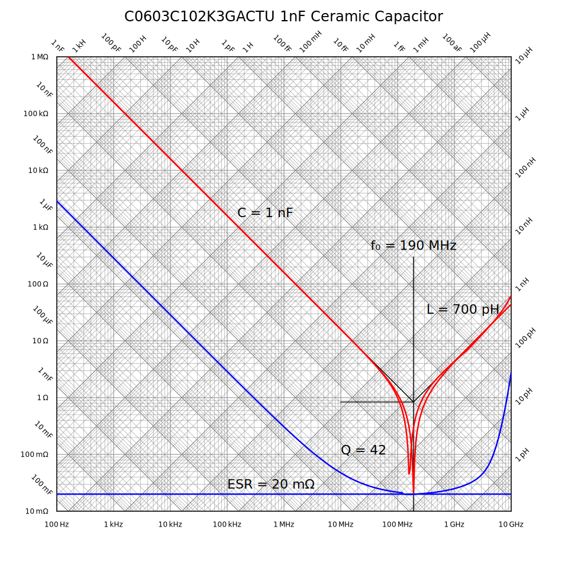

RLC Chart
=========

.. image:: https://img.shields.io/pypi/v/rlc_chart.svg
    :target: https://pypi.python.org/pypi/rlc_chart

.. image:: https://img.shields.io/pypi/pyversions/rlc_chart.svg
    :target: https://pypi.python.org/pypi/rlc_chart/

:Author: Ken Kundert
:Version: 0.1.0
:Released: 2021-03-25

What?
-----

*rlc_chart* is library that renders impedance charts in SVG with the normal
impedance versus frequency log-log grids, but they also include capacitance and
inductance grids.  They can be used to directly read component values from 
a plot of impedance.  This is explained in `Introduction to Phasors 
<https://designers-guide.org/theory/phasors.pdf>`_.

Consider the impedance of a capacitor that has series resistance and inductance 
parasitics along with a shunt resistor as represented by the following circuit:

You can use the various grids on this graph to determine the values of the 
various components: C = 1 nF, L = 10 μH, Rs = 2 Ω, Rp = 500 kΩ, and f₀ = 1.6 
MHz.  You can do this in other ways, but they involve manual calculation.  In 
addition, an RLC chart is a convenient way of sharing or publishing your 
findings.

Using an RLC chart is often enough to allow you to build a linear model for 
common two terminal components.

How?
----

Here is an example of how to use *rlc_chart*::

    from rlc_chart import RLC_Chart
    from math import log10 as log, pi as π

    Rs = 2
    Rp = 500_000
    C = 1e-9
    L = 10e-6
    fmin = 1
    fmax = 1e8
    zmin = 1
    zmax = 1e6
    mult = 10**((log(fmax) - log(fmin))/400)
    f = fmin
    freq = []
    impedance = []

    # Compute impedance of component
    # z1 = (Rs + 1/(jωC + jωL)     Rs=2Ω, C=1nF, L=10μH
    # z2 = Rp                      Rp=500kΩ
    # z = z1 ‖ z2
    while(f <= 1.01*fmax):
        z1 = Rs + 1/(2j*π*f*C) + 2j*π*f*L
        z2 = Rp
        z = z1 * z2 / (z1 + z2)
        freq += [f]
        impedance += [abs(z)]
        f *= mult

    with RLC_Chart('lcr-chart.svg', fmin, fmax, zmin, zmax) as chart:
        chart.add_trace(freq, impedance)

Most of the code builds the two arrays that represent the trace.  The impedance 
array is expected to contain real values.  In this case it is the magnitude that 
is being plotted, though it is also common to call *add_trace* twice to show 
both the real and imaginary parts of the impedance.

If you use the *Spectre* circuit simulator, you can use *psf_utils* with 
*rlc_chart* to extract models from simulation results. For example, here is the 
model of an inductor given by its manufacturer::

    subckt MCFE1412TR47_JB (1 2)
        R1 (1 7) resistor  r=0.036
        L5 (2 8) inductor  l=20u
        C2 (7 8) capacitor c=10.6p
        R2 (8 2) resistor  r=528
        C1 (7 9) capacitor c=28.5p
        R5 (9 2) resistor  r=3.7
        L0 (7 3) inductor  l=0.27u
        L1 (3 4) inductor  l=0.07u
        L2 (4 2) inductor  l=0.11u
        L3 (3 5) inductor  l=0.39u
        L4 (4 6) inductor  l=0.35u
        R3 (5 4) resistor  r=3.02158381422266
        R4 (6 2) resistor  r=43.4532529473926
    ends MCFE1412TR47_JB

This model is overly complicated and so expensive to simulate.  It requires 13 
extra unknowns that the simulator must compute (7 internal nodes and 6 inductor 
currents).  The impedance of this subcircuit is extracted by grounding one end 
and driving the other with a 1 A magnitude AC source.  Then, the RLC chart for 
this subcircuit can be generated with::

    from psf_utils import PSF
    from inform import Error, os_error, fatal
    from rlc_chart import RLC_Chart

    try:
        psf = PSF('MCFE1412TR47_JB.ac')
        sweep = psf.get_sweep()
        z_ckt = psf.get_signal('1')
        z_mod = psf.get_signal('2')

        with RLC_Chart('MCFE1412TR47_JB.svg', 100, 1e9, 0.01, 1000) as chart:
            chart.add_trace(sweep.abscissa, abs(z_ckt.ordinate), stroke='red')
            chart.add_trace(sweep.abscissa, abs(z_mod.ordinate), stroke='green')

        with RLC_Chart('MCFE1412TR47_JB.rxz.svg', 100, 1e9, 0.01, 1000) as chart:
            chart.add_trace(sweep.abscissa, abs(z.ordinate.real), stroke='green')
            chart.add_trace(sweep.abscissa, abs(z.ordinate.imag), stroke='orange')
            chart.add_trace(sweep.abscissa, abs(z.ordinate.real), stroke='blue')
            chart.add_trace(sweep.abscissa, abs(z.ordinate.imag), stroke='red')

    except Error as e:
        e.terminate()
    except OSError as e:
        fatal(os_error(e))

The RLC chart shows that the above subcircuit can be replaced with::

    subckt MCFE1412TR47_JB (1 2)
        L   (2 2) inductor l=442.24nH r=36mOhm
        C   (2 2) capacitor c=27.522pF
        R   (2 2) resistor r=537.46_Ohm
    ends MCFE1412TR47_JB

This version only requires one additional unknown, the inductor current, and so 
is considerably more efficient.

Here is the RLC chart of both showing the difference, which are inconsequential.

The differences are a bit more apparent if the real and imaginary components of 
the impedance are plotted separately.

The differences are significant only in the loss exhibited above resonance, 
which is usually not of concern.

The Details
-----------

RLC_Chart
"""""""""

The *RLC_Chart* class constructor takes the following required arguments:

filename:
    Path to the output SVG file.

*fmin*:
    The minimum frequency value (left-most value on the chart). This value is 
    always rounded down the next lower multiple of 10.  So for example, if you 
    give 25 Hz as *fmin*, then 10 Hz is used.

*fmax*:
    The maximum frequency value (right-most value on the chart). This value is 
    always rounded up the next higher multiple of 10.  So for example, if you 
    give 75 MHz as *fmax*, then 100 MHz is used.

*zmin*:
    The minimum impedance value (bottom-most value on the chart). This value is 
     always rounded down the next lower multiple of 10.  So for example, if you 
     give 150 mΩ *zmin*, then 100 mΩ is used.

*zmax*:
    The maximum impedance value (top-most value on the chart). This value is 
    always rounded up the next higher multiple of 10.  So for example, if you 
    give 800 kΩ as *zmax*, then 1 MΩ is used.

In addition, the following keyword arguments are optional.

*axes*:
    Specifies which axes are desired, where the choices are *f* for frequency, 
    *z* for impedance, *c* for capacitance, and *l* for inductance.  *axes* is 
    a string that contains any or all of the four characters, or not at all.  If 
    the characters are lower case, then only the major grid lines are drawn, and 
    if given as upper case letters, both the major and minor grid lines are 
    drawn.  The visual clutter in the chart can be reduces by eliminating 
    unneeded grid lines.

*trace_width*:
    The width of a trace. The default is 0.025 inches.

*trace_color*:
    The default color of the trace.  You can use one of the named SVG colors, or 
    you can use 'rgb(R,G,B)' where *R*, *G*, and *B* are integers between 0 and 
    255 that specify the intensity of red, blue, and green components of the 
    color.

*major_line_width*:
    The width of a major division line. The default is 0.01 inches.

*minor_line_width*:
    The width of a minor division line. The default is 0.005 inches.

*outline_line_width*:
    The width of grid outline. The default is 0.015 inches.

*outline_line_color*:
    The color of the grid outline.  The default is 'black'.

*fz_grid_color*:
    The color of the frequency and impedance grid lines.  The default is 'grey'.

*cl_grid_color*:
    The color of the capacitance and inductance grid lines.  The default is 
    'grey'.

*background*:
    The background color of the grid.  The default is 'white'.

*minor_divs*:
    The minor divisions to include.  The default is '123456789'.  Other common 
    values are '1', '13', '125', and '12468'.

*decade*:
    The size of one decade square.  The default is 1 inch. With this value, 
    a grid that is 6 decades wide and 4 decades high is 6" by 4".

*left_margin*:
    The size of the left margin.  The default is 1 inch.

*right_margin*:
    The size of the right margin.  The default is 1 inch.

*top_margin*:
    The size of the top margin.  The default is 1 inch.

*bottom_margin*:
    The size of the bottom margin.  The default is 1 inch.

*font_family*:
    The text font family.  The default is "sans-serif".

*font_size*:
    The text font size.  The default is 12.

*text_color*:
    The text color size.  The default is "black".

*text_offset*:
    The separation between the axis labels and the grid. The default is 0.15 
    inches.

*pixels_per_unit*:
    This is a scaling factor that allows you specify your dimensions to what 
    every units you wish.  A value of 96, the default, means that you are 
    specifying your units in inches.  A value of 37.8 allows you specify values 
    in centimeters. Etc.

In addition, many SVG parameters can be passed into *RLC_Chart*, in which case 
they are simply passed on to *svgwrite*.

Generally, *RLC_Chart* is the argument of a *with* statement. If you choose not 
to do this, then you must explicitly call the *close* method yourself.  Other 
than *close*, *RLC_Chart* provides several other methods, described next.

add_trace()
'''''''''''

This method adds a trace to the graph. It may be called multiple times to add 
additional traces. There are two required arguments:

*frequency*:
    An array of real values representing the frequency values of the points that 
    when connected make up the trace.

*impedance*:
    An array of real values representing the impedance values of the points that 
    when connected make up the trace.

Each of these arrays can be in the form of a *Python* list or a *numpy* array, 
and they must be the same length.

It is also possible to specify additional keyword arguments, which are passed on 
to *svgwrite* and attached to the trace. This can be used to specify trace color 
and style. For example, specify *stroke* to specify the trace color.

to_x()
''''''

Given a frequency, *to_x* returns the corresponding canvas coordinates.  This 
can be used to add SVG features to your chart like labels.

to_y()
''''''

Given an impedance, *to_y* returns the corresponding canvas coordinates.  This 
can be used to add SVG features to your chart like labels.

add_line()
''''''''''

Given a start and end value and a component value (*r*, *l*, *c*, or *f*), 
*add_line* draws a line on the chart.  If you specify *r*, the start and end 
values are frequencies and the line is horizontal with the impedance being *r*.  
If you specify *f*, the start and end values are impedances and the line is 
vertical and the frequency is *f*.  If you specify either *c* or *l* the start 
and end values are frequencies and the lines are diagonal and the impedance 
values are either 2π *f* *l* or 1/(2π *f* *c*).

It is also possible to specify additional keyword arguments, which are passed on 
to *svgwrite* and attached to the line. This can be used to specify line color 
and style. For example, specify *stroke* to specify the line color.

Labeling
--------

The chart object returned by *RLC_Chart* is a *svgwrite* *Drawing* object, and 
so you can call its methods to add SVG features to your chart.  This can be used 
to add labels to your charts.  Here is an example that demonstrates how to add 
labels and lines::

    from rlc_chart import RLC_Chart
    from inform import fatal, os_error
    from pathlib import Path
    from math import pi as π
    import csv

    fmin = 100
    fmax = 10e9
    zmin = 0.01
    zmax = 1e6
    cmod = 1e-9
    lmod = 700e-12
    rmod = 20e-3

    def model(f):
        return 1/(2j*π*f*cmod) + rmod + 2j*π*f*lmod

    frequency = []
    z_data = []
    r_data = []
    z_model = []
    r_model = []
    try:
        contents = Path('C0603C102K3GACTU_imp_esr.csv').read_text()
        data = csv.DictReader(contents.splitlines(), delimiter=',')
        for row in data:
            f = float(row['Frequency'])
            z = model(f)
            frequency.append(f)
            z_data.append(float(row['Impedance']))
            r_data.append(float(row['ESR']))
            z_model.append(abs(z))
            r_model.append(z.real)

        with RLC_Chart('C0603C102K3GACTU.svg', fmin, fmax, zmin, zmax, right_margin=2) as chart:

            # add annotations
            svg_text_args = dict(font_size = 24, fill = 'black')

            # capacitance
            chart.add(chart.text(
                "C = 1 nF",
                insert = (chart.to_x(150e3), chart.to_y(1.5e3)),
                **svg_text_args
            ))
            chart.add_line(1e3, 190.23e6, c=1e-9)

            # inductance
            chart.add(chart.text(
                "L = 700 pH",
                insert = (chart.to_x(12e9), chart.to_y(30)),
                text_anchor = 'start',
                **svg_text_args
            ))
            chart.add_line(190.232e6, 10e9, l=700e-12)

            # resistance
            chart.add(chart.text(
                "ESR = 20 mΩ",
                insert = (chart.to_x(100e3), chart.to_y(25e-3)),
                text_anchor = 'start',
                **svg_text_args
            ))
            chart.add_line(100e3, 1e9, r=20e-3)

            # resonant frequency
            chart.add(chart.text(
                "f₀ = 190 MHz",
                insert = (chart.to_x(190.23e6), chart.to_y(40)),
                text_anchor = 'middle',
                **svg_text_args
            ))
            chart.add_line(1e-2, 30, f=190.23e6)

            # Q
            chart.add(chart.text(
                "Q = 42",
                insert = (chart.to_x(10e6), chart.to_y(100e-3)),
                text_anchor = 'start',
                **svg_text_args
            ))
            chart.add_line(10e6, 190.23e6, r=836.66e-3)

            # title
            chart.add(chart.text(
                "C0603C102K3GACTU 1nF Ceramic Capacitor",
                insert = (chart.WIDTH/2, 36),
                font_size = 24,
                fill = 'black',
                text_anchor = 'middle',
            ))

            # add traces last, so they are on top
            chart.add_trace(frequency, z_data, stroke='red')
            chart.add_trace(frequency, r_data, stroke='blue')
            chart.add_trace(frequency, z_model, stroke='red', stroke_dasharray=(10,5))
            chart.add_trace(frequency, r_model, stroke='blue', stroke_dasharray=(10,5))

    except OSError as e:
        fatal(os_error(e))

This example demonstrates two different ways to specify the location of the 
label.  The *chart* object provides the *to_x* and *to_y* methods that convert 
data values into coordinates within the grid.  This is used to add labels on the 
traces.  The *chart* object also provides the *HEIGHT* and *WIDTH* attributes.  
These can be used to compute coordinates within the entire canvas. This is used 
to add a title that is near the top.

The example also illustrates the use of *add_line* to add dimension lines to the 
chart.

In this figure the solid traces are the data and the dashed traces are the 
model.  The red trace is the magnitude of the impedance, and the blue traces are 
the real part of the impedance, or the ESR.

Notice that in this chart the resistance at low frequencies drops with 1/*f*, 
just like the reactance.  In this regard the data differs significantly from the 
model.  This effect is referred to as dielectric absorption and it is both 
common and remarkable.  You can read more about it, and how to model it, in 
`Modeling Dielectric Absorption in Capacitors 
<https://designers-guide.org/modeling/da.pdf>`_.
